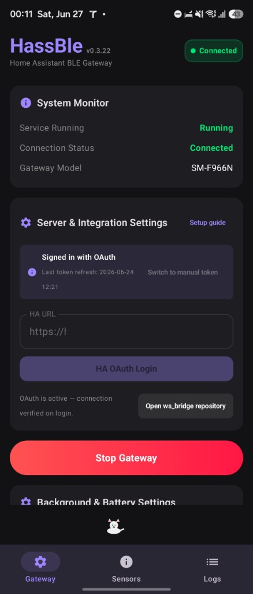
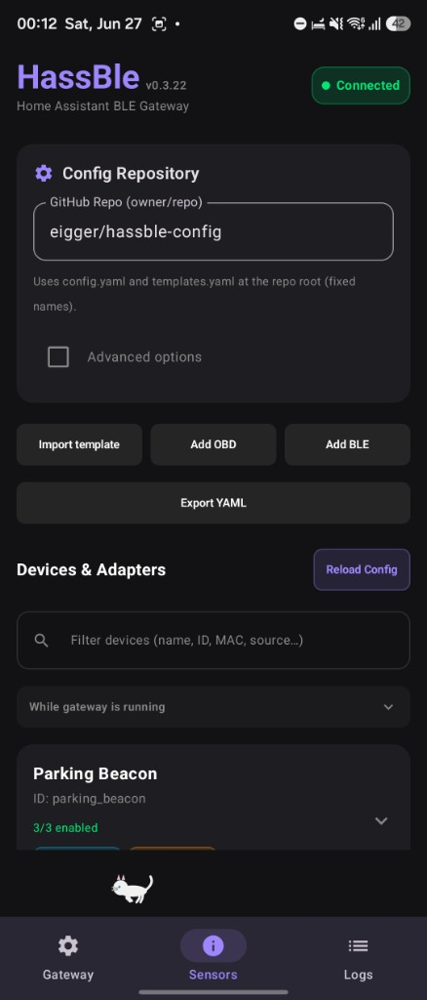
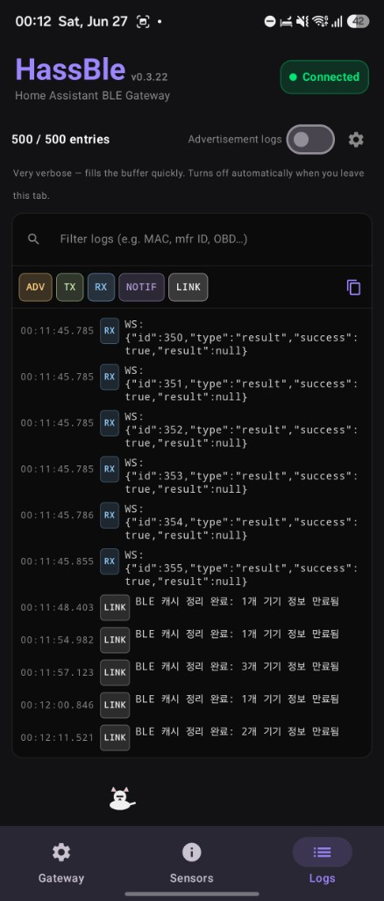
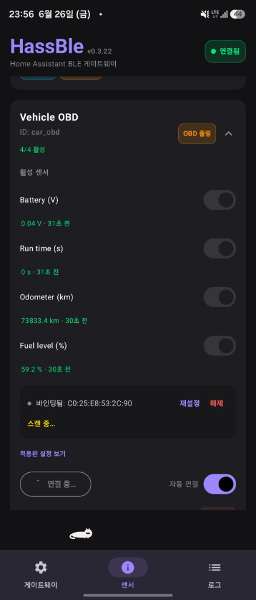
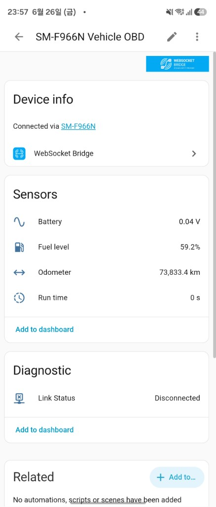

# HassBle

A system that turns a smartphone into a **BLE → Home Assistant gateway**.
It consists of two parts: a **Smart Android app (similar to the Companion app)** and a **Home Assistant bridge component**.

Instead of forwarding all raw packets (like ESPHome Bluetooth Proxy does), it parses and filters packets on the phone, sending **only changed sensor values** to Home Assistant, where they are exposed as **native entities**. Configuration (parsing rules) is **loaded by the app from Git**, and users **select which sensors** to apply on their phones.
It **does not use MQTT**, relying solely on the existing Home Assistant URL + access token (no additional ports required).

## Screenshots

| Gateway | Sensors | Logs |
|:---:|:---:|:---:|
|  |  |  |
| HA URL, OAuth, start/stop gateway | Git config, devices, sensor toggles | Live BLE/WS event log with filters |

## Architecture

```
[Android App: The Brain]             WebSocket          [HA Component ws_bridge: Generic Bridge]
  Load config from Git + presets  ◀──(HA WS API)──▶     Create entities upon receiving declaration
  Scan Ads / GATT / OBD polling                         Update entities upon receiving state
  Raw -> Decode -> Value filter                         Relay commands for switch/number/select/button
  Only declare/send selected sensors                    (No BLE/format knowledge, generic)
```

- Since only the phone has BLE, the **BLE I/O + config/decoding/filtering/selection is handled by the app**, while **Home Assistant only handles entity creation and updates**.
- `ws_bridge` is not BLE-specific but **generic** — any authenticated WebSocket client can create entities if it matches the protocol. This follows the same pattern as the Home Assistant Companion App's sensor register/update.

## Features

### BLE data paths
1. **Advertisement Parsing** — Decodes raw passive scan advertisements into Home Assistant sensors.
2. **OBD (ELM327) Polling** — Polls BLE OBD adapters like vLinker. Compatible with the preset/formula model of ESPHome [`ble_elm327`](https://github.com/eigger/espcomponents/tree/master/components/ble_elm327).

   | App (Sensors tab) | Home Assistant |
   |:---:|:---:|
   |  |  |
   | Bind ELM327 adapter, enable PIDs, auto-connect | Native sensors (fuel, odometer, battery, …) via ws_bridge |

3. **GATT notify + Bi-directional Control** — Receives data from push-based BLE devices and allows bi-directional control from Home Assistant to BLE devices via switch/number controls.

### App UI (three tabs)
| Tab | Purpose |
|-----|---------|
| **Gateway** | HA URL, OAuth or long-lived token, start/stop gateway, battery & scan settings. Shows a **readiness banner** when HA/Git/sensors are not ready. |
| **Sensors** | Git repo (`owner/repo` + branch), device list, sensor toggles, bind/connect. **Import template**, **Add OBD**, **Add BLE** (wizard), **Export YAML**. |
| **Logs** | Live event log (LINK/TX/RX/NOTIF/ADV), filter, copy, save/share. Tap MAC to filter or jump to Sensors tab. |

### Config workflow
- **Git config**: `config.yaml` at repo root (fixed filename). Default repo: [eigger/hassble-config](https://github.com/eigger/hassble-config).
- **Templates**: `templates.yaml` at repo root — import from Sensors tab. Bundled fallback in the app when offline.
- **Local draft devices**: Add OBD/BLE/template in the app → stored locally → **Export YAML** (merged or local-only) → commit to your Git repo manually.

## Repository Structure

```
app/                        Android App (Kotlin/Compose)
app/src/main/assets/        Bundled obd_presets.yaml, templates.yaml (offline fallback)
config.example.yaml         Example device config (advertisement)
templates.example.yaml      Example templates for Git repos
docs/DESIGN.md              Architecture & UX flow
docs/PROTOCOL.md            App ↔ HA WebSocket Protocol (App perspective)
docs/CONFIG_SCHEMA.md       Git config & templates YAML schema
```

> **Home Assistant component is in a separate repository**: `ws_bridge` (Generic WebSocket Bridge) is maintained at [hass-ws-bridge](https://github.com/eigger/hass-ws-bridge). The protocol specification is also hosted there in `PROTOCOL.md`.

## Quick Start

1. **Home Assistant**: Install `ws_bridge` via HACS or manually from [hass-ws-bridge](https://github.com/eigger/hass-ws-bridge) → Add integration "WebSocket Bridge" (no configuration needed).

2. **App — Gateway tab**
   - Enter **HA URL**.
   - Sign in with **HA OAuth** or paste a **long-lived access token**.
   - Fix any items shown in the readiness banner (red = blocking, orange = advisory).

3. **App — Sensors tab**
   - Enter **GitHub repo** as `owner/repo` (e.g. `eigger/hassble-config`) and branch (default `main`).
   - Optional: GitHub token for private repos.
   - Wait for config to load, **enable sensors** on each device.
   - Optional: import a template, add OBD/BLE devices, or export YAML for local drafts.

4. **App — Gateway tab**
   - Tap **Start Gateway**. The app runs as a foreground service with a persistent notification.

5. **Debugging**: Open the **Logs** tab while the gateway is running. Filter by MAC or message; long-press a MAC to search in Sensors.

No MQTT broker is required.

## Status

Core BLE paths (advertisement, GATT notify, OBD), config loading from Git, sensor selection, value filtering, OAuth, local draft devices, YAML export, and background service are implemented.

Planned / partial: mDNS HA discovery, bulk GATT bind by service UUID.

## License

This project is licensed under the MIT License. See the [LICENSE](LICENSE) file for details.
